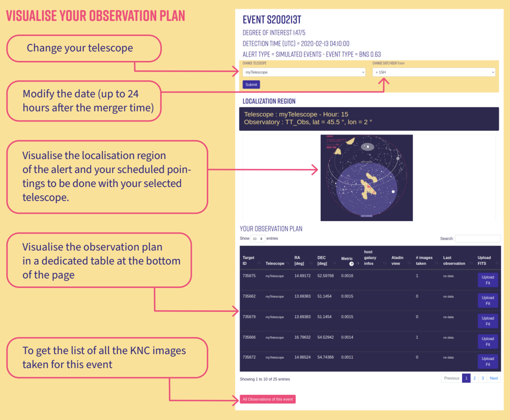
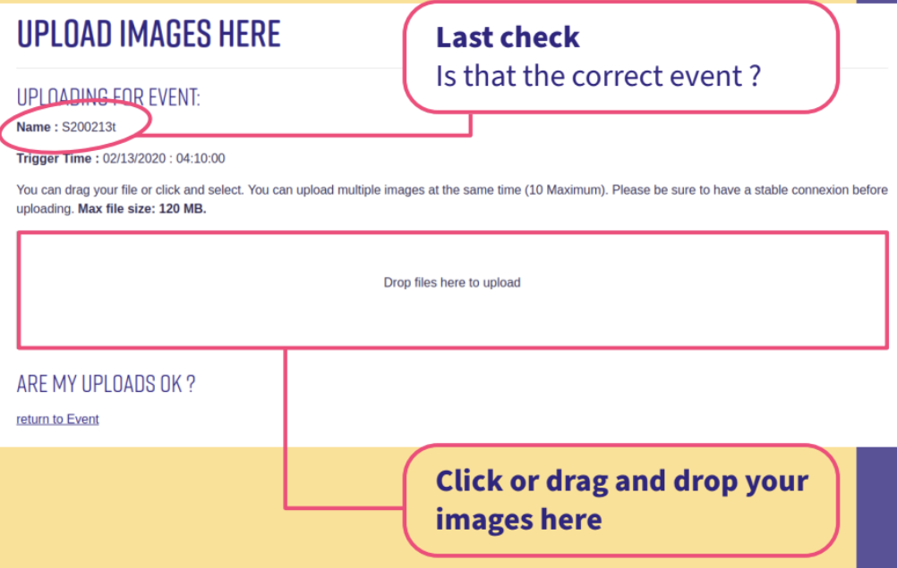

## KNC Protocol: How to Participate in Observations

This guide outlines how to register with **Kilonova Catcher (KNC)**, connect your telescope, receive alerts, and respond effectively to gravitational wave (GW) or gamma-ray burst (GRB) events. It also explains how we interact with the professional GRANDMA collaboration, where to find resources, and what is expected during real-time follow-up campaigns.

### 1. How to Register

1. Visit [kilonovacatcher.in2p3.fr](https://kilonovacatcher.in2p3.fr)
2. Click **"Join"** and create your user account
3. Verify your email address
4. Log in to access your dashboard

### 2. Add Your Telescope

1. Navigate to the **“Telescope”** tab
2. Click **“Add telescope”** and enter:
   - Your telescope's location
   - Aperture
   - Field of view
3. Once registered, it will appear under **“List of my telescopes.”**

*Make sure all values are accurate — they determine your observation plans.*

### 3. How KNC Sends Alerts

Our alerts are based on gravitational wave (LIGO/Virgo/KAGRA) and GRB satellite triggers. Alerts are decoded and filtered by **ICARE**, GRANDMA’s custom software, and distributed via:

- **Email**
    - Your dashboard at [kilonovacatcher.in2p3.fr](https://kilonovacatcher.in2p3.fr)
- **Slack**:
  - `#private-trigger-observations`: for event notifications and observing plans
  - `#observations`: for coordinating active follow-up and sharing coverage
    - **KNC_alert_bot** forwards a condensed version of the alerts from `#grbalerts` to the `#observations` channel.
- `#grbalerts` - KNC_alert_bot for Gamma-Ray Bursts (GRBs)
- `#gwalerts ` - KNC_alert_bot for Gravitational Waves (GWs) - **IN DEVELOPMENT**
- **Scientists**
  - We will provide information of the event directly in `#observations`.

  Please make sure to also join `#kilonova-catcher-news`!
 
  
  
### 4. Connecting to Slack

If you're not already in the Slack workspace, contact the KNC leadership (grandma.knc@gmail.com) to receive an invite.

### 5. What Happens During an Alert

1. You’ll receive an alert via Slack/email
2. Log in at [kilonovacatcher.in2p3.fr](https://kilonovacatcher.in2p3.fr)
3. Go to the alert page and download your **personalized observation plan**

Plans include:
- A list of galaxy fields (RA/Dec)
- Filter recommendations
- Expected brightness (e.g., for a kilonova similar to AT2017gfo)
- A skymap with your pointings

### 6. What Is Expected of You

- Use **both blue and red filters** (e.g., B & Rc or u & i)
- Integrate long enough to reach expected magnitude (typically 300s)
- Apply **dark, bias**, and preferably **flat corrections**
- Solve astrometry (use [nova.astrometry.net](https://nova.astrometry.net/upload))
- Upload **FITS** images via your dashboard

#### FITS File Requirements
- Header must include:
  - RA, Dec
  - Start/End time
  - Filter name
- No special characters in filenames: avoid `+`, `-`, `*`, `@`, etc. Please see **Preparing Raw Data** for the full naming convention expectation. 

**KNC and GRANDMA scientists will verify your images. Proper formatting ensures your data can be used.**

### 7. Revisiting Fields and Coordination

- Return to promising fields a few hours later
- Check `#observations` for requests from GRANDMA scientists
- Report your coverage so others can complement your work
- Ask questions or get support from other observers

### 8. How We Interact With GRANDMA

KNC is the **citizen science arm** of GRANDMA, a professional telescope network coordinating global transient follow-up.

- **ICARE** generates plans for all telescopes (professional + citizen)
- KNC participants receive the same alert content and observing regions
- Your data may contribute to joint publications or discovery announcements

### 9. Supporting Documents

#### [Kilonova Catcher Guidebook (PDF)](https://grandma.ijclab.in2p3.fr/files/2023/02/guidekilonovacatcher_en-1.pdf)

> **Summary**:  
> This guide introduces multi-messenger astronomy and explains how kilonovae are detected, why they matter, and how citizen scientists can contribute. It outlines the history of gravitational wave detection, current observatories, and how to join the project, register a telescope, and submit calibrated images. It also describes how KNC fits into the GRANDMA network.

#### [Astronomer's Guide (PDF)](https://drive.google.com/file/d/1Lc3CY6USfAp13_YMuFCHiQBHUsdVV1Nu/view)

> **Summary**:  
> This detailed brochure provides a visual walk-through of a neutron star merger, from gravitational wave emission to kilonova light curve evolution. It explains the observation strategy, what filters to use, how to prioritize targets, and how to ensure your FITS files meet GRANDMA’s standards. It is an essential reference for follow-up campaigns during O4.

### 10. Quick Checklist 

- [x] Join [kilonovacatcher.in2p3.fr](https://kilonovacatcher.in2p3.fr)  
- [x] Register your telescope  
- [x] Join `#private-trigger-observations` and `#observations` on Slack  
- [x] Monitor alerts and download plans  
- [x] Observe using blue/red filters  
- [x] Calibrate and upload your FITS files  
- [x] Coordinate revisits with the team  
- [x] Follow updates from GRANDMA

### 11. Contact Us

**KNC Team** - [grandma.knc@gmail.com](mailto:grandma.knc@gmail.com)  
**Damien Turpin** — [damien.turpin@cea.fr](mailto:damien.turpin@cea.fr)  
**Cristina Andrade** - [andra104@umn.edu](mailto:andra104@umn.edu)  
**Sarah Antier-Farfar** — [sarah.antier@oca.eu](mailto:sarah.antier@oca.eu)  

