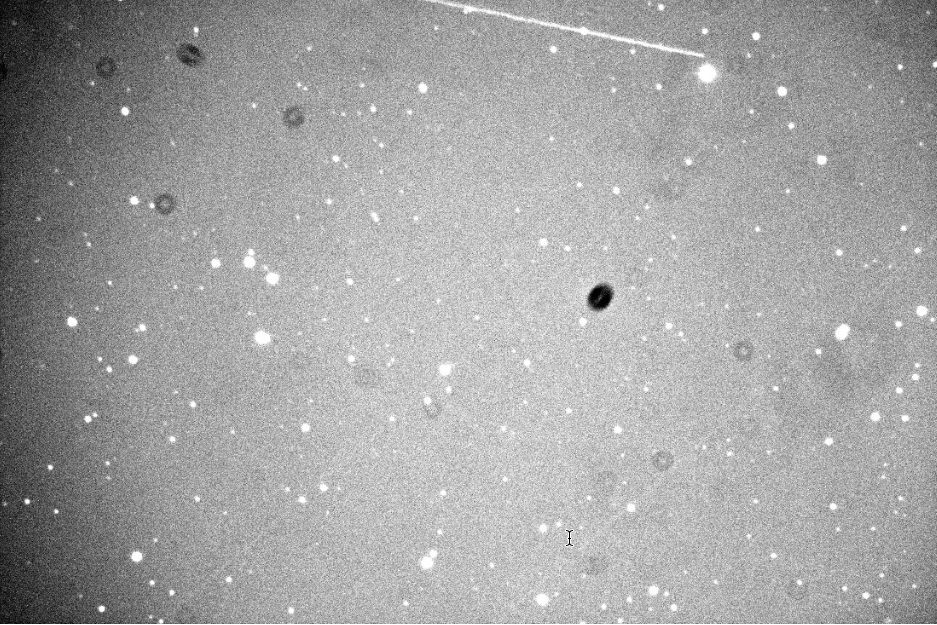
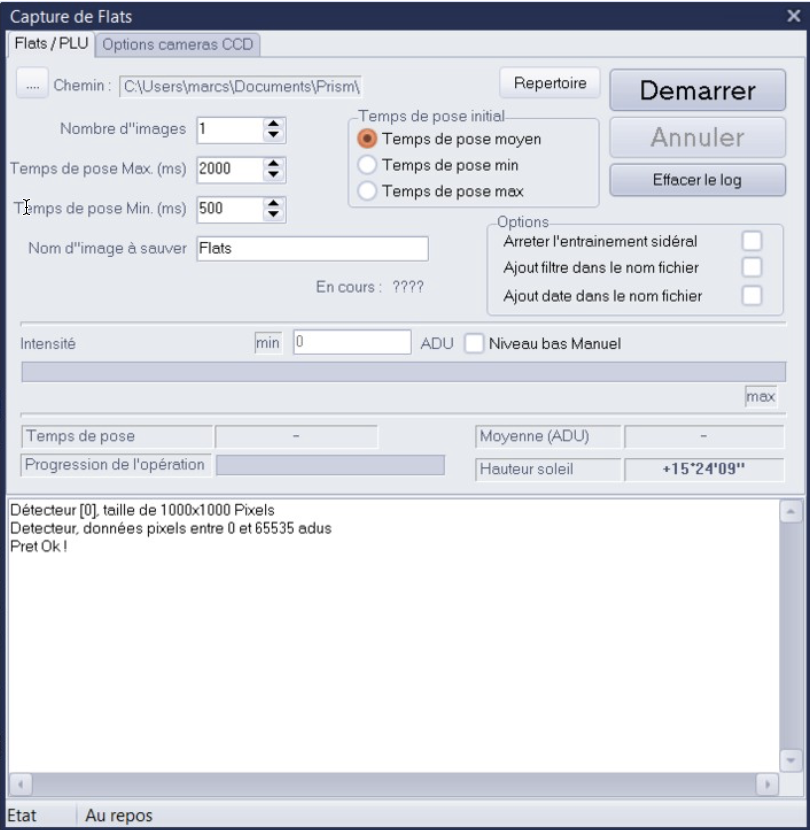
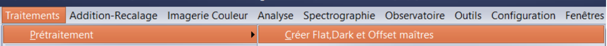
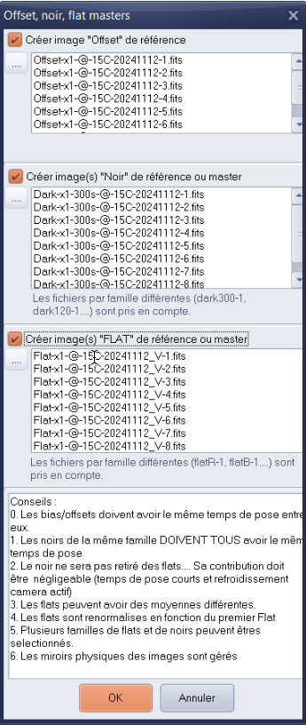
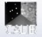
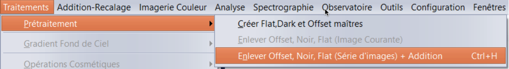
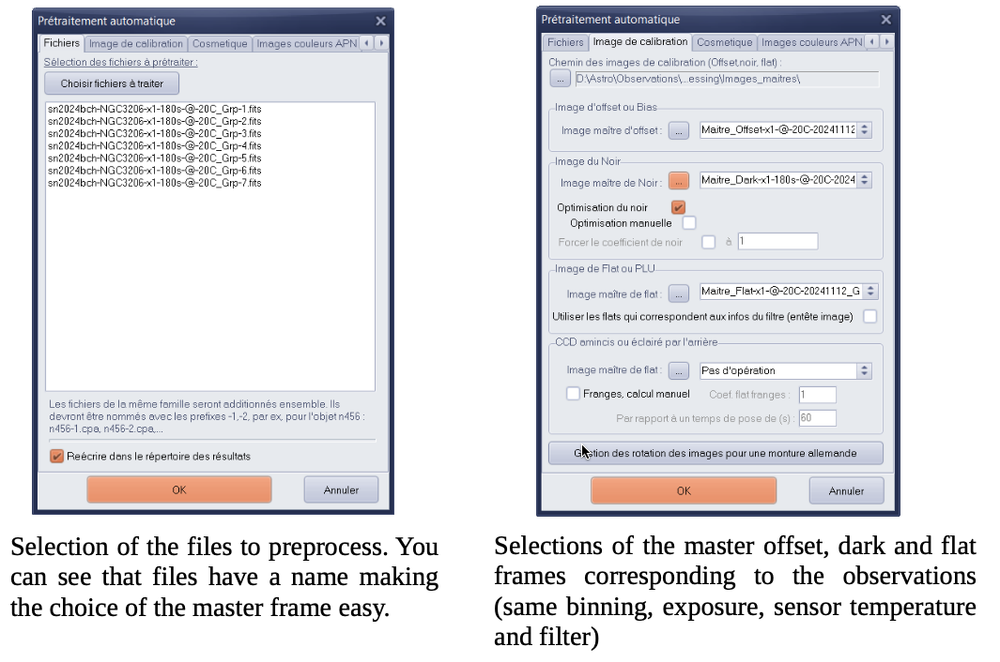
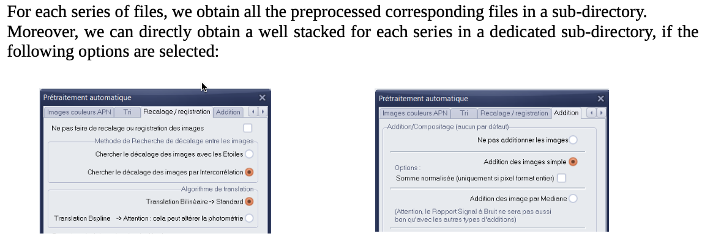

## Reccomended Software by KNC Members

### Preprocessing astronomical images with Prism V11 software (Marc Serrau's Workflow)

Astronomical images directly obtained with a numerical camera are always affected by defects due to the optics and the electronic of camera. 

Below, for instance, a rough image obtained after a 300s exposure. You can see several effects like shadows, vignetting, very bright pixels alone. Several effects like satellites tracks or cosmic rays signatures, defects in the sensor (bad column for instance) or blooming due to saturation in CCD sensor cannot be removed automatically.

Preprocessing is a process that can minimize these effects. When sky observers want to measure optical fluxes captured during exposures, this process is mandatory.

Two operations will be required before doing the preprocessing.

First we have to get frames and create master frames from them. The more frames used, the better the corrections will be, statistically speaking.

We will get
- flat frames and create a master flat frame from them. This master flat frame will serve to reduce the effect of shadows due to dust on the sensor and the optics in front of it. The vignetting and variation of quantum efficiency into the sensor will be also corrected.
- Dark and Offset frames and create a dark and an offset master frames from them. These master frames will statistically minimize the noise due to the electronic (dark current).

It is important to note that:
- We have to use one master flat for each optical combination used for observations, that's to say for each used filter.
- We have to create one master dark frame for each temperature of the sensor and each time of exposure.
All these frames will be obtained for a binning set to 1x1.

The Prism software allows us to create these frames and masters in a relative automatic sequence. As a result, a library of master frames will be created.

When all master frames are available, the preprocessing can be done. This operation will be very smooth.

All the following hard copy of the Prism software panels are in french but the tool may be configured in English. The following documentation is based on the V11 version of the tool but older version may be used. The appendix will give some links to some websites.

#### 2 Capturing Flat Frames

Flat frames can be obtained making pictures of a uniformly illuminated screen or of the bright sky during of the dusk or the dawn. If so, the telescope will be at sidereal standstill. No clouds or the Moon should be present. The time of exposure have to be short in order to minimize the temperature effect in the sensor. This is especially important for filters corresponding to the sensor low response bandwidth (for instance infrared filter for CMOS sensor).

If the mechanical configuration does not change night after night, flat frames can be keep for several nights.

The Prism software offers a functionality that takes flat frames automatically for one filter. See the panel on the right.

With Prism, it is possible to use a script that permits to take frame on the dusk for all the filter of a filter wheel.

#### 3 Capturing Dark and Offset frames

Offset and dark frames will be obtained by taking images without light entering the telescope. The telescope tube must be closed to avoid small light pollution that may be present in the surroundings. The temperature of the camera have to controlled to an acceptable level that will be used during observations. It is important to take care of that point when making dark and offset frames during the winter. During the summer night the camera may not reach the same temperature due to the limitation of the cooler.

The Prism software offers two functionality that takes dark and offset frames respectively for one temperature and exposure duration. See panels on the right. For offset, the exposure time will the shorter as possible.

Again, with Prism, it is possible to use a script that permits to take offset and dark frames automatically in one sequence, at the same temperature.

#### 4 Making Masters

Prism offers a plain function to create masters from flat frames, offset or dark frames. Accessible trough the menu (below)

or the single button (below). 

A panel appears where it is possible to loads the single frames of each kind.

Some remarks:

All offsets frames must have the same exposure duration.

All dark frames must have the same exposure duration.

A master offset will subtracted on all flat frames but no dark will be subtracted. Its effect have to be negligible (small duration during flat frame and cooled activated).

Flats may have different means and will be normalized from the first frame.

Several master flat or master dark may be created in the same operation depending on the name of the files.

Masters will be kept in a directory (a library of master frames) with names giving a clear signification to their contents. Doing so will help further application of the master during preprocessing,

#### 5 And finally, the preprocessing phase...

Having master files for offset dark and flat permit us to do the preprocessing easily. The following Prism menu

or the ⟳ button are dedicated to this operation:

The next panel will do the preprocessing with several options :

